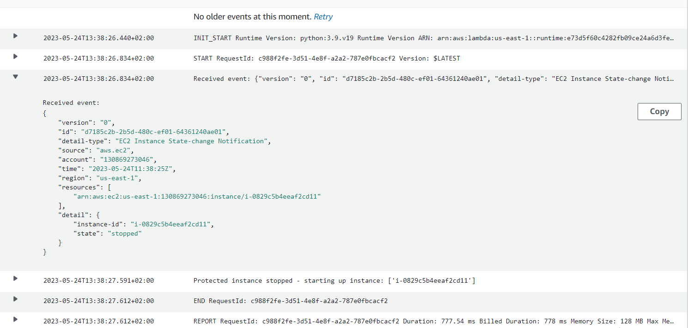

TASK - 10

Zadatak za 12 sedmicu predavanja DevOps Mentorship programa je da kompletiram sljedece lekcije iz kursa AWS Certified Solutions Architect - Associate (SAA-C03) dostupnog na linku:

https://learn.cantrill.io/courses/enrolled/1820301

# Serverless and Application Services

- [x] Architecture Deep Dive Part 1
- [x] Architecture Deep Dive Part 2
- [x] AWS Lambda Part 1
- [x] AWS Lambda Part 2
- [x] AWS Lambda Part 3
- [x] CludWatchEvents and Event Bridge
- [x] Automated EC2 Control using lambda and events Part 1 (DEMO)
- [x] Automated EC2 Control using lambda and events Part 2 (DEMO)
- [x] Serverless Architecture
- [x] Simple Notification Service (SNS)
- [x] Step Functions
- [x] API Gateway 101
- [x] Build a serverless app part 1
- [x] Build a serverless app part 2
- [x] Build a serverless app part 3
- [x] Build a serverless app part 4
- [x] Build a serverless app part 5
- [x] Build a serverless app part 6
- [x] Simple Queue Service (SQS)
- [x] SQS Stadanard vs FIFO Queus
- [x] SQS Delay Queues

# Architecture Deep Dive Part 1

* Monolitic Arhitecture – jedna kutija u kojoj su smještene sve komponente za izvršenje aplikacije. 
  Upload, processing, store i manage je jedan entitet. Kada je jedna komponenta failed, znači da su i ostale  failed. 
  Monolitne komponente skaliraju zajedno, tako da se skaliranje odvija vertikalno. Troškovi su isti za sve komponente, jer su uvijek u statusu running iako processing engine ne obavlja nikakve procese.

* Tiered Arhitecture – različiti slojevi, koji mogu biti na istom ili različitom serveru. Možemo raditi individualno skaliranje slojeva. Između slojeva moguće je postaviti Load Balancer čime omogućavamo horizontalno skaliranje i ako jedna instanca padne, Load Balancer će preusmjeriti saobraćaj ostalim instancama na tom sloju. Kao i kod Monolitic architecture slojevi su povezani međusobno, pa ako se desi nešto sa processing slojem dovodi do pada cijelog sistema.

# Architecture Deep Dive Part 2

* Queue je sistem koji prihvata poruke koje se dodaju ili budu povućene s njega. Razlikuje dva tipa queue:
1.	FIFO (Upload ide na S3 Bucket, dodaje se poruka u queue sa detaljima i čeka da je odgovarajući servis preuzme, upload ne zavisi od processinga)
2.	Standardni queue (redoslijed nije bitan)

* Queue arhitetectura – komponente razdvojene, mogu skalirati nezavisno jedna od druge
* Queue lenght je broj itema u Queue dodani od strane Upload 

* Microservices arhitecture – skup mikroservisa koji obavljaju individualne zadatke na primjer upload, process, store i manage.
* Event-Driven Architecture – zasniva se na eventima. Kolekcija Event Produce koji mogu biti komponente aplikacije koje ima komunikaciju sa korisnicima.

* Event Router – visoko dostupni, centralni endpoint za evente
- Nema konstantnog i bespotrebnog rada instanci i servisa kada nisu potrebni
- Postoje Produceri koji generisu evente kada se nesto desi 
- Nema stalnog cekanja i provjeravanja da li se event desio, vec svaki servis biva obavjesten kada treba poduzeti potrebne akcije 
- Event Router odlucuje kojem Consumer servisu dostavlja koji event 
- Kada event bude obradjen od strane Consumer servisa, servis se vraca  u stanje cekanja ili dormant state i ne koristi resurse

# AWS Lambda Part 1

-	Lambda je FaaS ( Function as a service). Lambda funkcija je dio koda koji Lambda pokreće.
-	Lambda koristi runtime koji želimo odabrati (npr. Python ili Java ili Ruby).
-	Naplačuje samo ono vrijeme koliko traje izvršavanje funkcije
-	Lambda funkcije mogu se izvršavati do 900 sekundi ili 15 minuta
-	Kada Lambda funkcija koristi vise memorije, automatski će se dodijeliti više CPU resursa kako bi se osiguralo brze izvođenje određene funkcije.

* Lambda se može koristiti za:
•	Serverless aplikacije (S3, API Gw, Lambda);
•	Za file procesiranje (S3, S3 događaji);
•	Za trigerovanje baza (DynamoDB, Streams, Lambda);
•	Serverless CRON;
•	Realtime Stream Data Processing (Kinesis + Lambda);

# AWS Lambda Part 2

* Lambda ima dva networking moda:
-	public (default) 
-	VPC 

* Public

Po defaultu lambda koristi public networking te ima konkeciju public AWS servisima i public internetu.
Lambda funcije koje koriste default networking nemaju pristup servisima koji su unutar VPC-a, ako nisu konfigurisani da im se može pristupiti izvan VPC-a. 
Public networking daje najbolje perfomanse jer ne zahtijeva specifičnu network konfiguraciju.

* VPC networking 

Lambda koja se nalazi u VPCu nasljeđuje sve VPC mrežne rulove. Tako da se može pristupiti svim resursima unutar VPC-a, ali ne mogu pristupiti stvarima izvan VPC-a, osim ako mrežno nije dopušten pristup eksternim servisima.
Lambdu unutar VPC-a moramo da posmatramo kaoi bilo koji drugi resurs unutar VPC-a.
Lambda resource policy – kontroliše koji servisi i računi mogu pozivati Lambda funkcije.
Lambda execution roles – su IAM roles pridružene Lambda funkcijama koje kontrolišu permisije koje Lambda funkcija prima.
Lambda koristi CloudWatch, CloudWatch Log i X-Ray.
CloudWatch Logs zahtjevaju permisije od Execution Role.
Lambda može biti integrisana sa X-Ray za praćenje korisnika.

# AWS Lambda Part 3

Tri metode pozivanja Lambda funkcije:

* Synchronous invocation – CLI/API poziva funkciju, proslijeđuje podatke i čeka na odgovor. Lambda funkcija odgovara sa podacima. Klijent komunicira sa API Gateway, koji proslijeđuje ka Lambda funkciji, koja odgovara sa succes ili fails ka API Gateway, koji proslijeđuje odgovor klijentu.

* Asynchronous invocation – AWS servisi pozivaju Lambda funkciju, ali se ne čeka odgovor. 
Lambda podržava destinacije (SQS, SNS, Lambda i Event Bridge) gdje se uspješni ili neuspješi događaji mogu slati.

* Event Source mappings – koristi se kod Streams ili queues koji ne generišu događaje da bi pozvali Lambdu ( Kinesis, DynamoDB streams, SQS).
Sa Event Source mapping, source servis ne šalje događaj, nego samo čita iz source-a.
Tako da Event Source mapping koristi permisije od Lambda Execution Role da bi pristupio source servisu.
Execution context - okruženje u kojem Lambda funkcija se starta.
Cold start - potpuno kreiranje i konfiguracija uključujući i download koda.
Warm start - Kada se koristi već postojeći Execution context (ne kreira se na novo).

# CloudWatch Events and Event Bridge

* CloudWatch Events – U real-time nam daje stream sistem eventa koji su se desili nekim AWS servisima. 
* Event Bridge – servis koji ima iste fukcionalnosti kao i CloudWatch Events. Može upravljati eventima od third parties applications. - - Pruža veću fleksibilnost u povezivanju eventa.
- Key Concepts
If X happens, or Y time(s) … do Z
X  - servis
Y – broj puta koliko se nešto desilo
Z – servis kojem se dostavlja event

# Automated EC2 Control using Lambda and Events PART  1 (DEMO)

# Automated EC2 Control using Lambda and Events - PART 2 (DEMO)

# Serverless Architecture

* Serverless je model gdje je cloud odgovoran za izvršavanje dio koda dinamički dodjeljivanjem resursa. 
Naplačuje se količina resursa koji su korišteni za pokretanje koda.

# Simple Notification Service (SNS)

SNS  javni AWS servis
Kordinira slanje i kodira poruke
Veličine poruke su manje ili jednake 256 KB
SNS Topic je base entitet SNS-a
Publisher šalje poruku na TOPIC
Pretplatnici mogu biti: HTTP, Email, SQS, Mobile Push, SMS Messages i Lambda

# Step Functions

Step function su implementacija Finite State Machine koju AWS nudi kao uslugu bez poslužitelja.
Maksimalno trajanje AWS Step Functions-a je jedna godina.

# API Gateway 101

* API Gateway je servis koji nam omogućava kreiranje i upravljamo API-ijima. API (Application Programming Interface) – način na koji aplikacije komuniciraju jedna sa drugom. 
Visoko dostupan i skalabilan servis.
Nalazi se između applications and integrations (services).
Može omogućiti API-je koji koriste HTTP, REST ili čak websocket bazirane API-ije.
API Gateway Cache se može koristiti za smanjenje poziva prema backend integracijama i da poboljša klijentske performanse. 
API Gateway – Endpoint tipovi:
-	Regional – klijenti u istoj regiji
-	Edge – Optimization – koristi se CloudFront
-	Private – pristup samo unutar VPC-a

API Gateway -Stages 
API-s su podijeljeni na stages.
Svaki stages ima 1 deployment.
Svaki stage ima svoj vlastiti jedinstveni URL endpointa. 

API Gateway - ERRORS
 -4xx Client Error - Invalid request on client side
 -5xx Server Error - Invalid Request, backend issue
 -400 - Bad request - Generic
 -403 - Access denied - Authorizer denies or WAF
 -429 - API Gateway can throttle
 -502 - Bad gateway exception - bad output returned
 -503 - Service unavaliable - backend endpoint offline
 -504 - Integration Failure/Timeout - 29 sec limit for integration

 # Build A Serverless App - Pet-Cuddle-o-Tron - PART1

 

 # Build A Serverless App - Pet-Cuddle-o-Tron - PART2

 
 
 

 # Build A Serverless App - Pet-Cuddle-o-Tron - PART3

 
 
 
 
 

 # Build A Serverless App - Pet-Cuddle-o-Tron - PART4

 # Build A Serverless App - Pet-Cuddle-o-Tron - PART5

# Simple Queue Service (SQS)

-	Javni servis, visoko dostupan
-	Standard Queue i FIFO Queue
-	Maksimalna veličina poruke do 256 KB
-	FIFO garantuje dostavu po redu i poruke će stići jednom
-	Standard Queue – garantuje da će poruke stići, ali ne moraju da stignu po redu po kojem su poslate.   Jedna poruka može stići više puta. 
-	Polling je proces provjere poruka unutar queue.
-	Ako se ista poruka pojavljuje veći broj puta a nije procesirana, onda se može poslati u Dead-Letter queue.

# SQS Delay Queues

Delay Queues – pružaju nam mogućnost da odgodimo dostavu poruka.